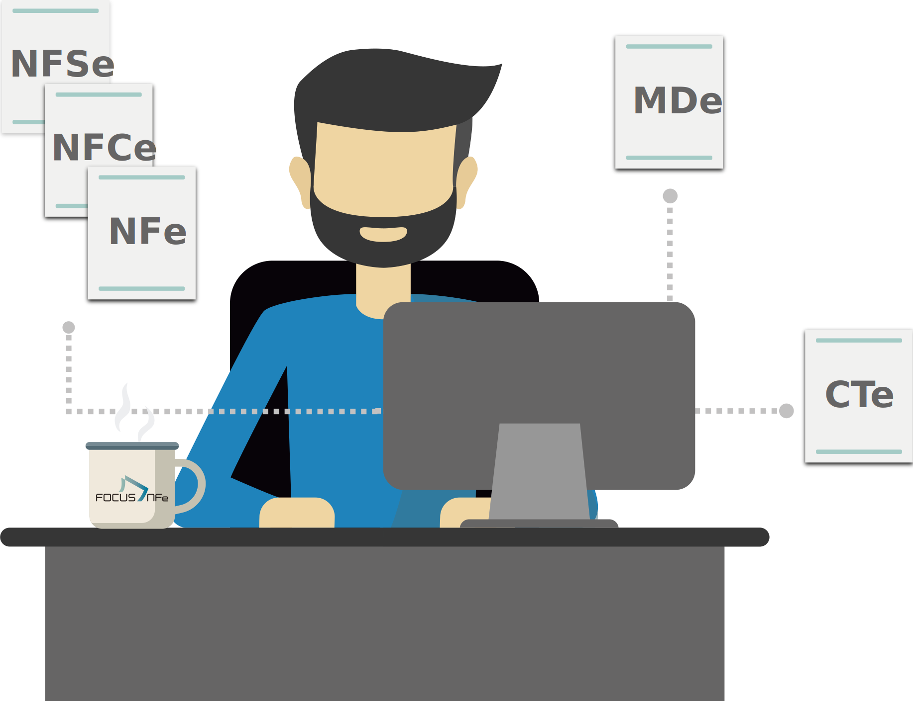

## FocusNFe Brazilian fiscal Issuer NF-e NFC-e Java REST API Client (Open Source) 

[](https://maven-badges.herokuapp.com/maven-central/org.frekele.fiscal/focusnfe-api-client)
[](http://www.javadoc.io/doc/org.frekele.fiscal/focusnfe-api-client)
[](https://travis-ci.org/frekele/focusnfe-api-client)
[](https://codecov.io/gh/frekele/focusnfe-api-client)
[](https://www.codacy.com/app/frekele/focusnfe-api-client?utm_source=github.com&amp;utm_medium=referral&amp;utm_content=frekele/focusnfe-api-client&amp;utm_campaign=Badge_Grade)
[](https://www.codacy.com/app/frekele/focusnfe-api-client?utm_source=github.com&utm_medium=referral&utm_content=frekele/focusnfe-api-client&utm_campaign=Badge_Coverage)




### REST Client - FocusNFe Brazilian fiscal Issuer NF-e NFC-e MD-e API

Built-based on the documentation: [https://focusnfe.com.br/doc/](https://focusnfe.com.br/doc/)

Project built with RESTEasy 3.5.x + Jackson 2.x.x.


#### Supported Java Versions:
- requires Java 8 (or higher) at runtime.


#### Maven dependency:
```xml
<dependency>
    <groupId>org.frekele.fiscal</groupId>
    <artifactId>focusnfe-api-client</artifactId>
    <version>1.0.1</version>
</dependency>
```

#### Gradle dependency:
```gradle
compile 'org.frekele.fiscal:focusnfe-api-client:1.0.1'
```

#### Repositories:

| Interfaces                   | Descriptions                            | Usage Examples                  |
| ---------------------------- | --------------------------------------- |-------------------------------- |
| [FocusNFeV2Repository]       | NF-e API V2 remote call                 | [FocusNFeV2RepositoryIT]        |
| [FocusNFCeV2Repository]      | NFC-e API V2 remote call                | [FocusNFCeV2RepositoryIT]       |
| [FocusMDeV2Repository]       | MD-e API V2 remote call                 | [FocusMDeV2RepositoryIT]        |
| [FocusWebHookV2Repository]   | WebHook API V2 remote call              | [FocusWebHookV2RepositoryIT]    |
| [FocusNcmV2Repository]       | NCM API V2 remote call                  | [FocusNcmV2RepositoryIT]        |
| [FocusBackupV2Repository]    | Backups API V2 remote call              | [FocusBackupV2RepositoryIT]     |


[FocusNFeV2Repository]: ./src/main/java/org/frekele/fiscal/focus/nfe/client/repository/nfe/FocusNFeV2Repository.java
[FocusNFCeV2Repository]: ./src/main/java/org/frekele/fiscal/focus/nfe/client/repository/nfce/FocusNFCeV2Repository.java
[FocusMDeV2Repository]: ./src/main/java/org/frekele/fiscal/focus/nfe/client/repository/mde/FocusMDeV2Repository.java
[FocusWebHookV2Repository]: ./src/main/java/org/frekele/fiscal/focus/nfe/client/repository/webhook/FocusWebHookV2Repository.java
[FocusNcmV2Repository]: ./src/main/java/org/frekele/fiscal/focus/nfe/client/repository/ncm/FocusNcmV2Repository.java
[FocusBackupV2Repository]: ./src/main/java/org/frekele/fiscal/focus/nfe/client/repository/backup/FocusBackupV2Repository.java


[FocusNFeV2RepositoryIT]: ./src/test/java/org/frekele/fiscal/focus/nfe/client/repository/nfe/FocusNFeV2RepositoryIT.java
[FocusNFCeV2RepositoryIT]: ./src/test/java/org/frekele/fiscal/focus/nfe/client/repository/nfce/FocusNFCeV2RepositoryIT.java
[FocusMDeV2RepositoryIT]: ./src/test/java/org/frekele/fiscal/focus/nfe/client/repository/mde/FocusMDeV2RepositoryIT.java
[FocusWebHookV2RepositoryIT]: ./src/test/java/org/frekele/fiscal/focus/nfe/client/repository/webhook/FocusWebHookV2RepositoryIT.java
[FocusNcmV2RepositoryIT]: ./src/test/java/org/frekele/fiscal/focus/nfe/client/repository/ncm/FocusNcmV2RepositoryIT.java
[FocusBackupV2RepositoryIT]: ./src/test/java/org/frekele/fiscal/focus/nfe/client/repository/backup/FocusBackupV2RepositoryIT.java


#### Example

```java
public class MyMainExample {

    public static void main(String[] args) {
        ResteasyClient client = new ResteasyClientBuilder().build();
        FocusNFeAuth auth = FocusNFeAuth.newBuilder()
            .withAccessToken("your-token-here")
            .withEnvironment(EnvironmentFocusNFeEnum.HOMOLOGATION)
            .build();

        FocusNFeV2Repository repository = new FocusNFeV2RepositoryImpl(client, auth);

        String reference = UUID.randomUUID().toString();
        NFeConsultarBodyResponse bodyResponse = repository.consultarNFeCompleta(reference).getBody();

        NFeProtocoloNotaFiscal protocoloNotaFiscal = bodyResponse.getProtocoloNotaFiscal();
        NFeRetornoRequisicaoNotaFiscal requisicaoNotaFiscal = bodyResponse.getRequisicaoNotaFiscal();
        String chaveNfe = requisicaoNotaFiscal.getChaveNfe();
        String pathXmlNFe = bodyResponse.getCaminhoXmlNotaFiscal();
        String pathDanfeNFe = bodyResponse.getCaminhoDanfe();
    }
}
```


#### Usage with CDI (Contexts and Dependency Injection)

```java
public class FocusNFeProducer {

    @Produces
    @FocusNFe
    public FocusNFeAuth producesFocusNFeAuth() {
        String accessToken = System.getenv("FOCUS_NFE_ACCESS_TOKEN");
        String environment = System.getenv("FOCUS_NFE_ENVIRONMENT");
        return new FocusNFeAuth(accessToken, environment);
    }

    @Produces
    @FocusNFe
    public ResteasyClient producesResteasyClient() {
        ResteasyClient client = new ResteasyClientBuilder()
                // Example:
                // Register your Custom Logging here.
                //.register(CustomLoggingFilter.class)
                .build();
        return client;
    }

    public void closeResteasyClient(@Disposes @FocusNFe ResteasyClient client) {
        client.close();
    }
}

//Then you just need to @inject.
public class MyService {

    @Inject
    @FocusNFe
    private FocusNFeV2Repository repository;

    public void callExample() {
        String reference = UUID.randomUUID().toString();
        NFeEnvioRequisicaoNotaFiscal nfe = NFeEnvioRequisicaoNotaFiscal.newBuilder()
            .withNaturezaOperacao("VENDA DE MERCADORIA")
            .withDataEmissao(OffsetDateTime.now())
            .withTipoDocumento(NFeTipoDocumentoEnum.NOTA_FISCAL_SAIDA)
	    ........... (add more fields)
            .build();
        NFeAutorizarResponse response = repository.autorizar(reference, new NFeAutorizarBodyRequest(nfe));
        NFeAutorizarBodyResponse body = response.getBody();
    }
}
```


#### Usage without CDI

```java
public class MyService {
    
    public void callExample() {
        //First create FocusNFeAuth
        Properties prop = // read your Properties or System.env
        String accessToken = prop.getProperty("accessToken");
        String environment = prop.getProperty("environment"); // PRODUCTION OR HOMOLOGATION
        FocusNFeAuth auth = FocusNFeAuth.newBuilder()
                .withAccessToken(accessToken)
                .withEnvironment(environment)
                .build();

        //Build one client per thread, or use CDI Injection.
        ResteasyClient client = new ResteasyClientBuilder()
                // Example, you can customize a connections.
                // Add proxy.
                //.defaultProxy("192.168.56.67", 3456)
                // Change connection Pool size.
                //.connectionPoolSize(3)
                // Change connection TTL.
                //.connectionTTL(30, TimeUnit.MINUTES)
                .build();

        FocusNFeV2Repository repository = new FocusNFeV2RepositoryImpl(client, auth);
        repository.autorizar(reference, new NFeAutorizarBodyRequest(nfe));

        //Is important to close in end, or use CDI.
        client.close();
    }
}
```


### Example usage NF-e and NFC-e 

#### POST - Autorizar NF-e (Asynchronous)
```java
String reference = UUID.randomUUID().toString();
NFeEnvioRequisicaoNotaFiscal nfe = NFeEnvioRequisicaoNotaFiscal.newBuilder()
    .withNaturezaOperacao("VENDA DE MERCADORIA")
    .withDataEmissao(OffsetDateTime.now())
    .withTipoDocumento(NFeTipoDocumentoEnum.NOTA_FISCAL_SAIDA)
    .withFinalidadeEmissao(NFeFinalidadeEmissaoEnum.NOTA_NORMAL)
    .withCnpjEmitente("39315364000104")
    .withNomeDestinatario("NF-E EMITIDA EM AMBIENTE DE HOMOLOGACAO - SEM VALOR FISCAL")
    .withCpfDestinatario("98445556550")
    .withTelefoneDestinatario("5196185555")
    .withLogradouroDestinatario("Av Otto Niemeyer")
    .withNumeroDestinatario("600")
    .withBairroDestinatario("Tristeza")
    .withMunicipioDestinatario("Porto Alegre")
    .withUfDestinatario(NFeUnidadeFederativaEnum.RIO_GRANDE_DO_SUL)
    .withCepDestinatario("91910-001")
    .withModalidadeFrete(NFeModalidadeFreteEnum.POR_CONTA_EMITENTE)
    .withItems(new ArrayList<>())
    .build();
NFeItem item = NFeItem.newBuilder()
    .withNumeroItem("1")
    .withCodigoProduto("XYZ-12345")
    .withDescricao("Produto Teste 12345 XYZ")
    .withCfop("5102")
    .withCodigoNcm("94036000")
    .withUnidadeComercial("UN")
    .withQuantidadeComercial(BigDecimal.valueOf(1))
    .withValorUnitarioComercial(new BigDecimal("124.35"))
    .withUnidadeTributavel("UN")
    .withQuantidadeTributavel(BigDecimal.valueOf(1))
    .withValorUnitarioTributavel(new BigDecimal("124.35"))
    .withValorBruto(new BigDecimal("124.35"))
    .withIcmsSituacaoTributaria(NFeIcmsSituacaoTributariaEnum.TRIBUTADA_SIMPLES_NACIONAL_SEM_PERMISSAO_CREDITO)
    .withIcmsOrigem(NFeIcmsOrigemEnum.NACIONAL)
    .withPisSituacaoTributaria(NFePisCofinsSituacaoTributariaEnum.OPERACAO_ISENTA_DA_CONTRIBUICAO)
    .withCofinsSituacaoTributaria(NFePisCofinsSituacaoTributariaEnum.OPERACAO_ISENTA_DA_CONTRIBUICAO)
    .withIncluiNoTotal(NFeIncluiNoTotalEnum.SIM)
    .build();
nfe.getItems().add(item);

NFeAutorizarBodyRequest bodyRequest = NFeAutorizarBodyRequest.newBuilder().withNfe(nfe).build();
NFeAutorizarResponse response = repository.autorizar(reference, bodyRequest);

//Get Body with Json Object Mapping.
NFeAutorizarBodyResponse responseBody = response.getBody();
//Get Body with String.
String responseBodyString = response.getBodyString();

//Get Http Header 'X-Rate-Limit-Limit'.
String responseHeaderValue = response.getRateLimitLimit();
//Get Http Header 'X-Rate-Limit-Remaining'.
String responseHeaderValue = response.getRateLimitRemaining();
//Get Http Header 'X-Rate-Limit-Reset'.
String responseHeaderValue = response.getRateLimitReset();
//Get Http Header 'X-Runtime'.
String responseHeaderValue = response.getRuntime();

//Get Http Status Response.
String responseStatus = response.getStatus();

//Get All Http Response.
Response httpResponse = response.getResponse();
```

#### POST - Autorizar NFC-e (Synchronous)
```java
.....
NFCeAutorizarBodyRequest bodyRequest = new NFCeAutorizarBodyRequest(nfce);
NFCeAutorizarResponse response = repository.autorizarConsultarNFeCompleta(reference, bodyRequest);
```

#### POST - AutorizarConsultarNFeCompleta NFC-e (Synchronous)
```java
.....
NFCeAutorizarBodyRequest bodyRequest = new NFCeAutorizarBodyRequest(nfce);
NFCeAutorizarResponse response = repository.autorizarConsultarNFeCompleta(reference, bodyRequest);
```

#### DELETE - Cancelar NF-e NFC-e
```java
NFeCancelarResponse response = repository.cancelar(reference, new NFeCancelarBodyRequest("Teste de cancelamento de nota"));

//Or with Builder Pattern.
NFeCancelarBodyRequest bodyRequest = NFeCancelarBodyRequest.newBuilder()
    .withJustificativa("Teste de cancelamento de nota")
    .build();
NFeCancelarResponse response = repository.cancelar(reference, bodyRequest);
```

#### POST - EmitirCCe NF-e
```java
NFeCCeBodyRequest bodyRequest = NFeCCeBodyRequest.newBuilder()
    .withCorrecao("Teste de carta de correcao")
    .build();
NFeCCeResponse response = repository.emitirCCe(reference, bodyRequest);
```

#### POST - EnviarEmail NF-e NFC-e
```java
NFeEmailBodyRequest bodyRequest = NFeEmailBodyRequest.newBuilder()
    .withEmails("alguem@example.org", "teste@teste.com.br")
    .build();
NFeEmailResponse response = repository.enviarEmail(reference, bodyRequest);
```

#### GET - Consultar NF-e NFC-e
```java
NFeConsultarResponse response = repository.consultar(reference);
```

#### GET - ConsultarNFeCompleta NF-e NFC-e
```java
NFeConsultarResponse response = repository.consultarNFeCompleta(reference);
```

#### POST - Inutilizar NF-e NFC-e
```java
NFeInutilizarBodyRequest bodyRequest = NFeInutilizarBodyRequest.newBuilder()
    .withCnpj("39315364000104")
    .withSerie("1")
    .withNumeroInicial("7")
    .withNumeroFinal("9")
    .withJustificativa("Teste de inutilizacao de nota")
    .build();
NFeInutilizarResponse response = repository.inutilizar(bodyRequest);
```


### Example usage MD-e

#### POST - Manifestar
```java
String chaveNFe = "41180684689100015855001002510000040306642480";
MDeManifestarBodyRequest bodyRequest = MDeManifestarBodyRequest.newBuilder()
    .withTipo(MDeTipoManifestacaoEnum.CONFIRMACAO)
    .withJustificativa("Fornecedor entregou produtos")
    .build();
MDeManifestarResponse response = repository.manifestar(chaveNFe, bodyRequest);
```

#### GET - ConsultarManifestos
```java
String cnpjEmitente = "39315364000104";
MDeConsultarManifestosResponse response = repository.consultarManifestos(cnpjEmitente);

//Or with parameter 'versao'
MDeConsultarManifestosResponse response = repository.consultarManifestos(cnpjEmitente, 40);
```

#### GET - ConsultarManifestos
```java
String cnpjEmitente = "39315364000104";
MDeConsultarManifestosResponse response = repository.consultarManifestosPendentes(cnpjEmitente);

//Or with parameter 'versao'
MDeConsultarManifestosResponse response = repository.consultarManifestosPendentes(cnpjEmitente, 40);
```

#### GET - ConsultarUltimoManifesto
```java
String chaveNFe = "41180684689100015855001002510000040306642480";
MDeConsultarUltimoManifestoResponse response = repository.consultarUltimoManifesto(chaveNFe);
```

#### GET - ConsultarNFe
```java
String chaveNFe = "41180684689100015855001002510000040306642480";
MDeConsultarNFeResponse response = repository.consultarNFe(chaveNFe);
```

#### GET - ConsultarNFeCompleta
```java
String chaveNFe = "41180684689100015855001002510000040306642480";
MDeConsultarNFeResponse response = repository.consultarNFeCompleta(chaveNFe);
```

#### GET - DownloadNFe
```java
String chaveNFe = "41180684689100015855001002510000040306642480";
MDeDownloadXmlResponse response = repository.downloadNFe(chaveNFe);
```

#### GET - DownloadCancelamento
```java
String chaveNFe = "41180684689100015855001002510000040306642480";
MDeDownloadXmlResponse response = repository.downloadCancelamento(chaveNFe);
```

#### GET - DownloadUltimaCCe
```java
String chaveNFe = "41180684689100015855001002510000040306642480";
MDeDownloadXmlResponse response = repository.downloadUltimaCCe(chaveNFe);
```


### Example usage WebHooks

#### POST - Criar
```java
String cnpjEmitente = "39315364000104";
WebHookCriarBodyRequest bodyRequest = WebHookCriarBodyRequest.newBuilder()
    .withCnpj(cnpjEmitente)
    .withEvent("nfe")
    .withUrl("http://minha.url/nfe")
    .build();
WebHookCriarResponse response = repository.criar(bodyRequest);
String webHookId = bodyResponse.getId());
```

#### GET - Consultar
```java
WebHookConsultarResponse response = repository.consultar(webHookId);
```

#### GET - ConsultarTodos
```java
WebHookConsultarTodosResponse response = repository.consultarTodos();
```

#### DELETE - Excluir
```java
WebHookExcluirResponse response = repository.excluir(webHookId);
```


### Example usage for search NCMs

#### GET - Consultar
```java
NcmConsultarResponse response = repository.consultar("94036000");
```

#### GET - ConsultarTodos
```java
NcmQueryParam queryParam = NcmQueryParam.newBuilder().build();
NcmConsultarTodosResponse response = repository.consultarTodos(queryParam);
```

#### GET - ConsultarTodos
```java
NcmQueryParam queryParam = NcmQueryParam.newBuilder().build();
NcmConsultarTodosResponse response = repository.consultarTodos(queryParam);

//Or with queryParams
NcmQueryParam queryParam = NcmQueryParam.newBuilder()
    .withCapitulo("94")
    .withPosicao("03")
    .withSubposicao1("6")
    .withSubposicao2("0")
    .withItem1("0")
    .withItem2("0")
    .build();
NcmConsultarTodosResponse response = repository.consultarTodos(queryParam);

//Or with offset
NcmQueryParam queryParam = NcmQueryParam.newBuilder()
    .withCodigo("9")
    .withOffset("20")
    .build();
NcmConsultarTodosResponse response = repository.consultarTodos(queryParam);
```


### Example usage for search Backups

#### GET - Consultar
```java
String cnpjEmitente = "39315364000104";
BackupConsultaResponse response = repository.consultarTodos(cnpjEmitente);
```


#### Custom Logging for Response and Request

With the filter you can intercept all requests during sending and receiving responses.
Everything before the Jackson conversion (json to Object) and (Object to Json).

```java
public class CustomLoggingFilter implements ClientResponseFilter, ClientRequestFilter {

    private Logger logger = Logger.getLogger(CustomLoggingFilter.class.getName());

    @Override
    public void filter(ClientRequestContext requestContext) throws IOException {
        this.getLogger().debug("--> Request LoggingFilter: Uri = " + requestContext.getUri());
        this.getLogger().debug("--> Request LoggingFilter: Method= " + requestContext.getMethod());
        // Add more logs as you want.
    }

    @Override
    public void filter(ClientRequestContext requestContext, ClientResponseContext responseContext) throws IOException {
        this.getLogger().debug("<-- Response LoggingFilter:");
        this.getLogger().debug("<-- Response LoggingFilter: Status = " + responseContext.getStatus());
        // Add more logs as you want.
    }

    public Logger getLogger() {
        return logger;
    }
}
```


### If you need to convert Json or Objects manually, do so:


#### Json --> JsonNode
```java
JsonNode jsonNode = FocusNFeUtils.parseJsonToJsonNode(content);
```

#### Json --> Object
```java
String content = "{ ..... }";
Class classType = MDeManifesto.class;
MDeManifesto manifesto = FocusNFeUtils.parseJsonTo(content, classType);
```

#### JsonNode --> String
```java
String jsonString = FocusNFeUtils.parseJsonToString(jsonNode);

//with pretty printer
String jsonString = FocusNFeUtils.parseJsonToString(jsonNode, true);
```

#### Xml --> JsonNode
```java
JsonNode jsonNode = FocusNFeUtils.parseXmlToJsonNode(content);
```

#### Xml --> Document
```java
Document document = FocusNFeUtils.parseXmlToDocument(content);
```

#### Json --> Object
```java
ObjectMapper mapper = new ObjectMapper();
String json = "{ ........ }";
MDeManifesto manifesto = mapper.readValue(json, MDeManifesto.class);
```

#### Json --> List
```java
ObjectMapper mapper = new ObjectMapper();
String jsonArray = "[{ ........ }]";
List<MDeManifesto> manifestos = mapper.readValue(jsonArray, new TypeReference<List<MDeManifesto>>(){});
```

#### Object --> Json
```java
ObjectMapper mapper = new ObjectMapper();
MDeManifesto manifesto = MDeManifesto.newBuilder().build();
String json = mapper.writeValueAsString(manifesto);
```

#### List --> Json
```java
ObjectMapper mapper = new ObjectMapper();
List<MDeManifesto> manifestos = new ArrayList<>();
manifestos.add(manifesto1);
manifestos.add(manifesto2);
String jsonArray = mapper.writeValueAsString(manifestos);
```

### Compile:

#### Compile with Maven:
```
mvn clean install -Dgpg.skip
```

#### Compile with integration Tests:
You need to add the environment variables to run the integration tests.
 - FOCUS_NFE_ACCESS_TOKEN = //Your Access-Token
 - FOCUS_NFE_CNPJ_EMITENTE  = //Your CNPJ
```
mvn clean install -Dgpg.skip -DskipITs=false
```

frekele/focusnfe-api-client is **licensed** under the **[MIT License]**. The terms of the license are as follows:

    MIT License

    Copyright (c) 2018 @frekele<Leandro Kersting de Freitas>

    Permission is hereby granted, free of charge, to any person obtaining a copy
    of this software and associated documentation files (the "Software"), to deal
    in the Software without restriction, including without limitation the rights
    to use, copy, modify, merge, publish, distribute, sublicense, and/or sell
    copies of the Software, and to permit persons to whom the Software is
    furnished to do so, subject to the following conditions:

    The above copyright notice and this permission notice shall be included in all
    copies or substantial portions of the Software.

    THE SOFTWARE IS PROVIDED "AS IS", WITHOUT WARRANTY OF ANY KIND, EXPRESS OR
    IMPLIED, INCLUDING BUT NOT LIMITED TO THE WARRANTIES OF MERCHANTABILITY,
    FITNESS FOR A PARTICULAR PURPOSE AND NONINFRINGEMENT. IN NO EVENT SHALL THE
    AUTHORS OR COPYRIGHT HOLDERS BE LIABLE FOR ANY CLAIM, DAMAGES OR OTHER
    LIABILITY, WHETHER IN AN ACTION OF CONTRACT, TORT OR OTHERWISE, ARISING FROM,
    OUT OF OR IN CONNECTION WITH THE SOFTWARE OR THE USE OR OTHER DEALINGS IN THE
    SOFTWARE.
